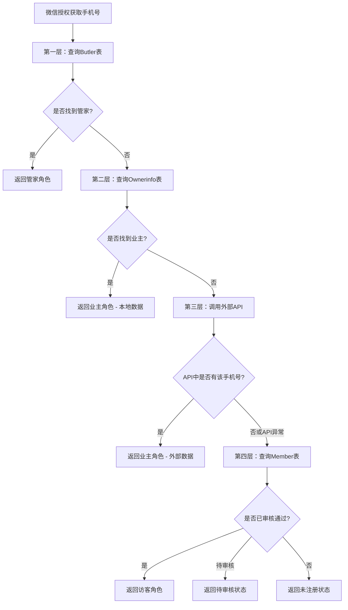

# 四层角色判断逻辑（含外部API）

## 🎯 升级目标

在原有三层角色体系基础上，增加外部API查询作为业主身份的补充验证，解决ownerinfo表数据不全的问题。

## 🔄 新的四层查询逻辑

### Java后端实现

```java
private Map<String, Object> determineUserRole(String phoneNumber, String openid) {
    Map<String, Object> userInfo = new HashMap<>();
    userInfo.put("phone", phoneNumber);
    
    logger.info("开始四层角色查询，手机号: [{}], openid: [{}]", phoneNumber, openid);
    
    // 第一层：查询管家表 (最高优先级)
    Butler butler = butlerService.list().stream()
        .filter(b -> phoneNumber.equals(b.getPhone()))
        .findFirst()
        .orElse(null);
        
    if (butler != null) {
        logger.info("第一层查询成功：找到管家角色");
        userInfo.put("role", "manager");
        userInfo.put("roleText", "管家");
        userInfo.put("userInfo", butler);
        userInfo.put("permissions", getManagerPermissions());
        userInfo.put("source", "butler_table");
        return userInfo;
    }
    
    // 第二层：查询业主表
    List<Ownerinfo> ownerList = ownerinfoService.phoneNumberOwnerInfo(phoneNumber);
    if (!ownerList.isEmpty()) {
        Ownerinfo owner = ownerList.get(0);
        logger.info("第二层查询成功：找到业主角色（本地数据）");
        userInfo.put("role", "owner");
        userInfo.put("roleText", "业主");
        userInfo.put("userInfo", owner);
        userInfo.put("permissions", getOwnerPermissions());
        userInfo.put("source", "ownerinfo_table");
        return userInfo;
    }
    
    // 第三层：查询外部API（业主补充验证）
    try {
        boolean isOwnerFromAPI = checkOwnerFromExternalAPI(phoneNumber);
        if (isOwnerFromAPI) {
            logger.info("第三层查询成功：找到业主角色（外部API）");
            
            // 创建临时业主信息（从API获取）
            Map<String, Object> apiOwnerInfo = getOwnerInfoFromAPI(phoneNumber);
            
            userInfo.put("role", "owner");
            userInfo.put("roleText", "业主");
            userInfo.put("userInfo", apiOwnerInfo);
            userInfo.put("permissions", getOwnerPermissions());
            userInfo.put("source", "external_api");
            userInfo.put("needSync", true); // 标记需要同步到本地数据库
            return userInfo;
        }
    } catch (Exception e) {
        logger.warn("第三层查询失败：外部API调用异常", e);
        // API调用失败不影响后续查询
    }
    
    // 第四层：查询Member表 (访客)
    Member member = memberService.getMemberByOpenId(openid);
    if (member != null && "已通过".equals(member.getAuditstatus())) {
        logger.info("第四层查询成功：找到访客角色");
        userInfo.put("role", "visitor");
        userInfo.put("roleText", "访客");
        userInfo.put("userInfo", member);
        userInfo.put("permissions", getVisitorPermissions());
        userInfo.put("source", "member_table");
        return userInfo;
    }
    
    // 第五层：待审核状态
    if (member != null && "待审批".equals(member.getAuditstatus())) {
        logger.info("第五层：用户申请待审核");
        userInfo.put("role", "pending");
        userInfo.put("roleText", "待审核");
        userInfo.put("userInfo", member);
        userInfo.put("permissions", new String[]{});
        userInfo.put("source", "member_table");
        userInfo.put("message", "您的申请正在审核中，请耐心等待");
        return userInfo;
    }
    
    // 第六层：完全未注册的用户
    logger.info("第六层：用户未注册");
    userInfo.put("role", "unregistered");
    userInfo.put("roleText", "未注册");
    userInfo.put("userInfo", null);
    userInfo.put("permissions", new String[]{});
    userInfo.put("source", "none");
    userInfo.put("message", "请先申请注册");
    return userInfo;
}

/**
 * 调用外部API检查是否为业主
 */
private boolean checkOwnerFromExternalAPI(String phoneNumber) {
    try {
        // 调用外部API获取月票列表
        List<Map<String, Object>> ticketList = getOnlineMonthTicketList();
        
        // 检查手机号是否在列表中
        return ticketList.stream()
            .anyMatch(ticket -> phoneNumber.equals(ticket.get("userPhone")));
            
    } catch (Exception e) {
        logger.error("调用外部API失败", e);
        return false;
    }
}

/**
 * 从外部API获取业主详细信息
 */
private Map<String, Object> getOwnerInfoFromAPI(String phoneNumber) {
    try {
        List<Map<String, Object>> ticketList = getOnlineMonthTicketList();
        
        Optional<Map<String, Object>> ownerTicket = ticketList.stream()
            .filter(ticket -> phoneNumber.equals(ticket.get("userPhone")))
            .findFirst();
            
        if (ownerTicket.isPresent()) {
            Map<String, Object> ticket = ownerTicket.get();
            
            // 构建业主信息
            Map<String, Object> ownerInfo = new HashMap<>();
            ownerInfo.put("ownername", ticket.get("userName"));
            ownerInfo.put("ownerphone", ticket.get("userPhone"));
            ownerInfo.put("carno", ticket.get("carNo"));
            ownerInfo.put("source", "external_api");
            ownerInfo.put("originalData", ticket); // 保存原始API数据
            
            return ownerInfo;
        }
        
    } catch (Exception e) {
        logger.error("从外部API获取业主信息失败", e);
    }
    
    // 返回基本信息
    Map<String, Object> ownerInfo = new HashMap<>();
    ownerInfo.put("ownerphone", phoneNumber);
    ownerInfo.put("source", "external_api");
    return ownerInfo;
}

/**
 * 调用外部API获取月票列表
 */
private List<Map<String, Object>> getOnlineMonthTicketList() {
    List<Map<String, Object>> allTickets = new ArrayList<>();
    int pageNum = 1;
    int pageSize = 100;
    boolean hasMore = true;
    
    while (hasMore) {
        try {
            // 构建请求参数
            Map<String, Object> params = new HashMap<>();
            params.put("pageNum", pageNum);
            params.put("pageSize", pageSize);
            params.put("parkCodeList", Arrays.asList("2KUG6XLU")); // 根据实际情况配置
            params.put("validStatus", 1);
            
            // 调用API
            String response = callExternalAPI(
                "https://openydt.yidianting.xin/Api/getOnlineMonthTicketList", 
                params
            );
            
            // 解析响应
            Map<String, Object> result = parseAPIResponse(response);
            List<Map<String, Object>> pageTickets = (List<Map<String, Object>>) result.get("data");
            
            if (pageTickets != null && !pageTickets.isEmpty()) {
                allTickets.addAll(pageTickets);
                
                // 如果返回数据少于pageSize，说明已经是最后一页
                hasMore = pageTickets.size() >= pageSize;
                pageNum++;
            } else {
                hasMore = false;
            }
            
        } catch (Exception e) {
            logger.error("调用外部API第{}页失败", pageNum, e);
            hasMore = false;
        }
    }
    
    logger.info("从外部API获取到{}条月票数据", allTickets.size());
    return allTickets;
}

/**
 * 调用外部API
 */
private String callExternalAPI(String url, Map<String, Object> params) {
    // 这里使用您现有的HTTP客户端，比如RestTemplate或OkHttp
    // 示例使用RestTemplate
    
    HttpHeaders headers = new HttpHeaders();
    headers.setContentType(MediaType.APPLICATION_JSON);
    
    HttpEntity<Map<String, Object>> request = new HttpEntity<>(params, headers);
    
    ResponseEntity<String> response = restTemplate.postForEntity(url, request, String.class);
    
    if (response.getStatusCode() == HttpStatus.OK) {
        return response.getBody();
    } else {
        throw new RuntimeException("API调用失败，状态码：" + response.getStatusCode());
    }
}

/**
 * 解析API响应
 */
private Map<String, Object> parseAPIResponse(String response) {
    try {
        ObjectMapper mapper = new ObjectMapper();
        return mapper.readValue(response, Map.class);
    } catch (Exception e) {
        throw new RuntimeException("解析API响应失败", e);
    }
}
```

## 🎨 角色判断流程图



## 📝 配置建议

### 1. application.yml配置

```yaml
external-api:
  ticket-list:
    url: https://openydt.yidianting.xin/Api/getOnlineMonthTicketList
    timeout: 10000
    retry-count: 3
    park-codes:
      - "2KUG6XLU"
    cache-duration: 300  # 缓存5分钟
```

### 2. 缓存优化

```java
@Service
public class ExternalAPIService {
    
    @Cacheable(value = "ownerTickets", key = "#phoneNumber")
    public boolean isOwnerInExternalAPI(String phoneNumber) {
        return checkOwnerFromExternalAPI(phoneNumber);
    }
    
    @CacheEvict(value = "ownerTickets", allEntries = true)
    @Scheduled(fixedDelay = 300000) // 5分钟清除一次缓存
    public void clearCache() {
        logger.info("清除外部API缓存");
    }
}
```

## 🚀 优势

1. **数据完整性提升**：解决ownerinfo表数据不全的问题
2. **实时性保证**：外部API数据更及时
3. **降级处理**：API异常时不影响正常流程
4. **数据同步**：可标记需要同步的业主数据
5. **性能优化**：增加缓存机制减少API调用

## ⚠️ 注意事项

1. **API调用频率**：避免过度调用，建议增加缓存
2. **异常处理**：API异常不应影响其他角色判断
3. **数据同步**：建议将外部API数据同步到本地
4. **权限配置**：确保API调用权限和网络访问
5. **监控告警**：监控API调用成功率和响应时间

这个四层查询机制让业主身份判断更加准确和完整！ 