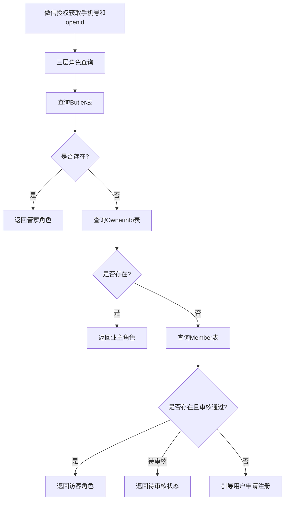
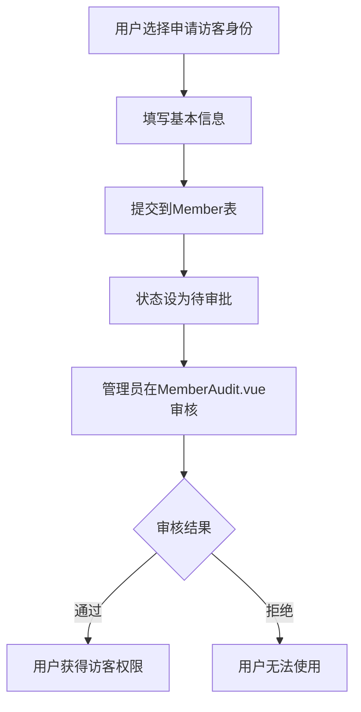

# 改进后的角色判断逻辑

## 🎯 新的三层角色体系

### 角色优先级
1. **管家** (Butler表) - 最高权限
2. **业主** (Ownerinfo表) - 中等权限  
3. **访客** (Member表) - 基础权限

### 改进后的determineUserRole方法

```java
private Map<String, Object> determineUserRole(String phoneNumber, String openid) {
    Map<String, Object> userInfo = new HashMap<>();
    userInfo.put("phone", phoneNumber);
    
    logger.info("开始三层角色查询，手机号: [{}], openid: [{}]", phoneNumber, openid);
    
    // 第一层：查询管家表 (最高优先级)
    Butler butler = butlerService.list().stream()
        .filter(b -> phoneNumber.equals(b.getPhone()))
        .findFirst()
        .orElse(null);
        
    if (butler != null) {
        logger.info("找到管家角色");
        userInfo.put("role", "manager");
        userInfo.put("roleText", "管家");
        userInfo.put("userInfo", butler);
        userInfo.put("permissions", getManagerPermissions());
        return userInfo;
    }
    
    // 第二层：查询业主表
    List<Ownerinfo> ownerList = ownerinfoService.phoneNumberOwnerInfo(phoneNumber);
    if (!ownerList.isEmpty()) {
        Ownerinfo owner = ownerList.get(0);
        logger.info("找到业主角色");
        userInfo.put("role", "owner");
        userInfo.put("roleText", "业主");
        userInfo.put("userInfo", owner);
        userInfo.put("permissions", getOwnerPermissions());
        return userInfo;
    }
    
    // 第三层：查询Member表 (访客)
    Member member = memberService.getMemberByOpenId(openid);
    if (member != null && "已通过".equals(member.getAuditstatus())) {
        logger.info("找到访客角色");
        userInfo.put("role", "visitor");
        userInfo.put("roleText", "访客");
        userInfo.put("userInfo", member);
        userInfo.put("permissions", getVisitorPermissions());
        return userInfo;
    }
    
    // 第四层：未找到任何角色或未审核通过
    if (member != null && "待审批".equals(member.getAuditstatus())) {
        logger.info("用户申请待审核");
        userInfo.put("role", "pending");
        userInfo.put("roleText", "待审核");
        userInfo.put("userInfo", member);
        userInfo.put("permissions", new String[]{});
        userInfo.put("message", "您的申请正在审核中，请耐心等待");
        return userInfo;
    }
    
    // 完全未注册的用户
    logger.info("用户未注册");
    userInfo.put("role", "unregistered");
    userInfo.put("roleText", "未注册");
    userInfo.put("userInfo", null);
    userInfo.put("permissions", new String[]{});
    userInfo.put("message", "请先申请注册");
    return userInfo;
}

/**
 * 获取访客权限列表
 */
private String[] getVisitorPermissions() {
    return new String[]{
        "appointment.create",      // 创建访客预约
        "appointment.query.own"    // 查询自己的预约
    };
}
```

## 🔄 改进后的完整流程

### 用户首次使用小程序


### 访客注册流程


## 📱 小程序TabBar配置

### 访客TabBar (2个Tab)
```javascript
visitor: [
  {
    index: 0,
    pagePath: "pages/reservation/form",
    text: "访客预约",
    show: true
  },
  {
    index: 1, 
    pagePath: "pages/reservation/searchResult/searchResult",
    text: "预约查询",
    show: true
  },
  // 不显示违规和审核功能
  {
    index: 2,
    pagePath: "pages/violation/owner-new-violation",
    text: "违规车辆", 
    show: false
  },
  {
    index: 3,
    pagePath: "pages/site/facility",
    text: "审核",
    show: false
  }
]
```

## 🎨 角色主题区分

### 访客主题
```javascript
visitor: {
  selectedColor: '#52c41a', // 访客绿色
  color: '#7A7E83',
  backgroundColor: '#ffffff'
}
```

## 💡 优势

1. **角色覆盖完整**：管家、业主、访客三种角色
2. **权限层次清晰**：不同角色有不同的功能权限
3. **审核机制保留**：访客也需要审核，确保安全
4. **扩展性好**：未来可以添加更多角色类型
5. **用户体验好**：每种角色都有合适的功能界面

## 🔧 需要修改的文件

1. **WeChatAuthController.java** - 修改角色判断逻辑
2. **DynamicTabBarManager.js** - 添加访客TabBar配置
3. **permission.js** - 添加访客权限定义
4. **phone-auth.vue** - 处理访客注册流程
5. **各页面权限控制** - 根据访客权限调整页面功能 