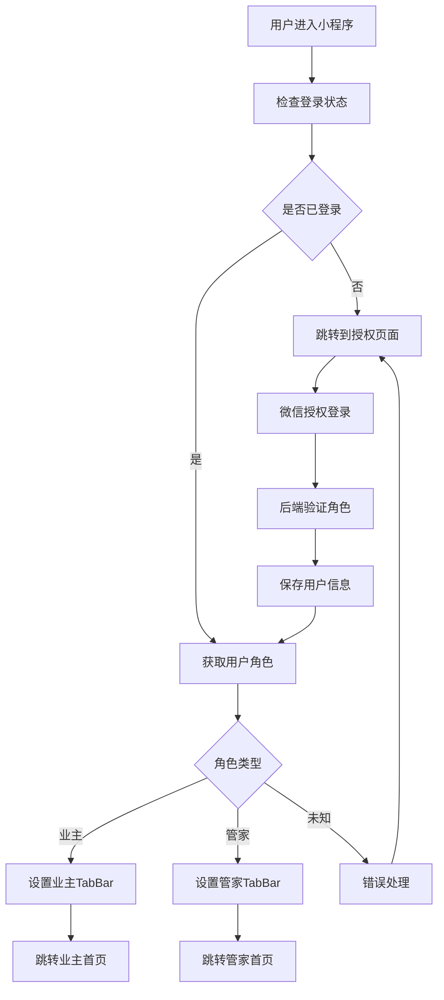

# 雪人停车小程序 - 角色权限管理与动态TabBar实现方案

## 📋 项目概述

### 业务需求
实现基于用户角色的动态TabBar显示，不同角色用户看到不同的底部导航功能：
- **业主角色**：预约、预约查询、违规车辆 (3个Tab)
- **管家角色**：预约、预约查询、违规管理、审核 (4个Tab)

### 技术目标
1. 用户登录后根据角色自动切换TabBar配置
2. 不同角色显示不同数量和内容的Tab项
3. 角色权限验证和页面访问控制
4. 良好的用户体验和视觉区分

---

## 🎯 技术方案选择

### 方案对比

| 方案 | 描述 | 优势 | 劣势 | 推荐度 |
|------|------|------|------|--------|
| **方案一：原生TabBar API** | 使用uni.setTabBarItem()动态调整 | 简单可靠、性能好、兼容性佳 | 自定义程度有限 | ⭐⭐⭐⭐⭐ |
| 方案二：自定义TabBar组件 | 完全自定义TabBar组件 | 高度自定义、灵活性强 | 复杂度高、维护成本大 | ⭐⭐⭐ |
| 方案三：中转页面分发 | 使用temp.vue做路由分发 | 逻辑清晰 | 增加跳转步骤、体验不佳 | ❌ |

### 最终选择：方案一（原生TabBar API）

**理由**：
- ✅ 开发复杂度低，维护成本低
- ✅ 性能优秀，原生渲染
- ✅ 完美兼容所有平台
- ✅ 稳定可靠，不易出bug

---

## 👥 角色权限设计

### 角色定义

#### 业主角色 (owner)
```json
{
  "role": "owner",
  "roleText": "业主",
  "permissions": [
    "appointment.create",      // 创建预约
    "appointment.query.own",   // 查询自己的预约
    "violation.view.own"       // 查看自己的违规
  ],
  "tabBar": [
    "预约", "预约查询", "违规车辆"
  ]
}
```

#### 管家角色 (manager)
```json
{
  "role": "manager", 
  "roleText": "管家",
  "permissions": [
    "appointment.query",       // 查询预约
    "appointment.audit",       // 审核预约
    "violation.manage",        // 违规管理
    "owner.manage",           // 业主管理
    "audit.process"           // 审核处理
  ],
  "tabBar": [
    "预约", "预约查询", "违规管理", "审核"
  ]
}
```

### 登录流程设计



---

## 🔧 技术实现方案

### 核心文件结构

```
car-new-demo/
├── utils/
│   ├── dynamicTabBar.js      # TabBar动态管理器 ⭐
│   ├── permission.js         # 权限工具类
│   └── auth.js              # 认证工具类
├── mixins/
│   └── auth.js              # 权限验证混入 ⭐
├── api/
│   └── auth.js              # 认证相关API
├── config/
│   └── tabbar.js            # TabBar配置文件
└── pages/
    ├── auth/
    │   └── phone-auth.vue    # 授权登录页面 ⭐
    └── violation/
        ├── owner-new-violation.vue  # 业主违规页面
        └── violation.vue            # 管家违规管理页面
```

### 1. 动态TabBar管理器

#### `utils/dynamicTabBar.js`

```javascript
class DynamicTabBarManager {
  
  // 角色TabBar配置
  static tabBarConfigs = {
    // 业主配置 (3个Tab)
    owner: [
      {
        index: 0,
        pagePath: "pages/reservation/form",
        text: "预约",
        iconPath: "static/coolc/icon/home.png",
        selectedIconPath: "static/coolc/icon/home_selected.png",
        show: true
      },
      {
        index: 1,
        pagePath: "pages/reservation/searchResult/searchResult",
        text: "预约查询",
        iconPath: "static/icons/carReservation/car_reservation.png",
        selectedIconPath: "static/icons/carReservation/car_reservation_selected.png",
        show: true
      },
      {
        index: 2,
        pagePath: "pages/violation/owner-new-violation", // 业主违规
        text: "违规车辆",
        iconPath: "static/L_AID_Violation.png",
        selectedIconPath: "static/icon-violation-nature.png",
        show: true
      },
      {
        index: 3,
        pagePath: "pages/site/facility",
        text: "审核",
        show: false // 业主不显示审核
      }
    ],
    
    // 管家配置 (4个Tab)
    manager: [
      {
        index: 0,
        pagePath: "pages/reservation/form",
        text: "预约",
        iconPath: "static/coolc/icon/home.png",
        selectedIconPath: "static/coolc/icon/home_selected.png",
        show: true
      },
      {
        index: 1,
        pagePath: "pages/reservation/searchResult/searchResult",
        text: "预约查询",
        iconPath: "static/icons/carReservation/car_reservation.png",
        selectedIconPath: "static/icons/carReservation/car_reservation_selected.png",
        show: true
      },
      {
        index: 2,
        pagePath: "pages/violation/violation", // 管家违规管理
        text: "违规管理",
        iconPath: "static/L_AID_Violation.png",
        selectedIconPath: "static/icon-violation-nature.png",
        show: true
      },
      {
        index: 3,
        pagePath: "pages/site/facility",
        text: "审核",
        iconPath: "static/icons/facility/unselected.png",
        selectedIconPath: "static/icons/facility/selected.png",
        show: true // 管家显示审核
      }
    ]
  };

  // 核心方法：根据角色设置TabBar
  static async setTabBarByRole(role = 'owner') {
    console.log('🔄 设置TabBar，角色:', role);
    
    const config = this.tabBarConfigs[role] || this.tabBarConfigs.owner;
    const visibleTabs = config.filter(item => item.show);
    
    try {
      await this.hideTabBar();
      
      // 设置可见Tab项
      for (let i = 0; i < visibleTabs.length; i++) {
        const item = visibleTabs[i];
        await this.setTabBarItem({
          ...item,
          index: i
        });
      }
      
      // 隐藏多余Tab位置
      if (visibleTabs.length < 4) {
        for (let i = visibleTabs.length; i < 4; i++) {
          await this.hideTabBarItem(i);
        }
      }
      
      await this.setRoleStyle(role);
      await this.showTabBar();
      
      console.log('✅ TabBar设置完成');
      
    } catch (error) {
      console.error('❌ TabBar设置失败:', error);
    }
  }

  // 设置角色主题样式
  static setRoleStyle(role) {
    const styles = {
      manager: {
        selectedColor: '#FF6B35', // 管家橙色
        color: '#7A7E83',
        backgroundColor: '#FFFFFF'
      },
      owner: {
        selectedColor: '#12a7f5', // 业主蓝色
        color: '#7A7E83',
        backgroundColor: '#FFFFFF'
      }
    };

    const style = styles[role] || styles.owner;
    
    return new Promise((resolve) => {
      uni.setTabBarStyle({
        ...style,
        success: resolve,
        fail: resolve
      });
    });
  }

  // 其他辅助方法...
  static setTabBarItem(item) { /* 实现代码 */ }
  static hideTabBarItem(index) { /* 实现代码 */ }
  static hideTabBar() { /* 实现代码 */ }
  static showTabBar() { /* 实现代码 */ }
}

export default DynamicTabBarManager;
```

### 2. 权限验证混入

#### `mixins/auth.js`

```javascript
import DynamicTabBarManager from '@/utils/dynamicTabBar.js';

export default {
  onLoad() {
    this.checkPageAuth();
  },
  
  onShow() {
    this.checkPageAuth();
    this.refreshTabBar();
  },
  
  methods: {
    // 检查页面权限
    checkPageAuth() {
      const userInfo = uni.getStorageSync('userInfo');
      
      if (!userInfo || !userInfo.isAuthorized) {
        const currentPage = getCurrentPages().pop().route;
        if (!currentPage.includes('phone-auth')) {
          uni.reLaunch({
            url: '/pages/auth/phone-auth'
          });
          return false;
        }
      }
      
      return true;
    },
    
    // 刷新TabBar
    refreshTabBar() {
      const userInfo = uni.getStorageSync('userInfo');
      const role = userInfo?.role;
      
      if (role) {
        DynamicTabBarManager.setTabBarByRole(role);
      }
    },
    
    // 检查功能权限
    hasPermission(permission) {
      const userInfo = uni.getStorageSync('userInfo');
      if (!userInfo || !userInfo.userInfo?.permissions) {
        return false;
      }
      
      return userInfo.userInfo.permissions.includes(permission);
    },
    
    // 权限不足处理
    handleNoPermission(message = '权限不足') {
      uni.showModal({
        title: '访问受限',
        content: message,
        showCancel: false,
        success: () => {
          uni.navigateBack();
        }
      });
    }
  }
}
```

### 3. App.vue集成

#### 在`App.vue`中集成TabBar管理

```javascript
// App.vue
import DynamicTabBarManager from '@/utils/dynamicTabBar.js';

export default {
  onLaunch() {
    console.log('App Launch');
    setTimeout(() => {
      this.initializeApp();
    }, 500);
  },

  onShow() {
    this.refreshTabBar();
  },

  methods: {
    // 初始化应用
    async initializeApp() {
      try {
        const userInfo = uni.getStorageSync('userInfo');
        
        if (userInfo && userInfo.isAuthorized) {
          const role = userInfo.role;
          console.log('🚀 用户已登录，角色:', role);
          
          // 设置TabBar
          await DynamicTabBarManager.setTabBarByRole(role);
          
          // 保存到全局状态
          this.setGlobalData('isAuthorized', true);
          this.setGlobalData('userInfo', userInfo);
          this.setGlobalData('currentRole', role);
          
        } else {
          console.log('🔐 用户未登录');
          // 设置默认TabBar或隐藏
          this.setGlobalData('isAuthorized', false);
        }
        
      } catch (error) {
        console.error('应用初始化失败:', error);
      }
    },

    // 刷新TabBar
    async refreshTabBar() {
      const userInfo = uni.getStorageSync('userInfo');
      const currentRole = userInfo?.role;
      const globalRole = this.getGlobalData('currentRole');
      
      if (currentRole && currentRole !== globalRole) {
        console.log('🔄 角色变化，重新设置TabBar:', globalRole, '->', currentRole);
        await DynamicTabBarManager.setTabBarByRole(currentRole);
        this.setGlobalData('currentRole', currentRole);
      }
    },

    // 全局数据管理
    getGlobalData(key) {
      const app = getApp();
      return app.globalData?.[key];
    },

    setGlobalData(key, value) {
      const app = getApp();
      if (!app.globalData) app.globalData = {};
      app.globalData[key] = value;
    }
  }
}
```

### 4. pages.json配置

```json
{
  "pages": [
    {
      "path": "pages/auth/phone-auth",
      "style": {
        "navigationStyle": "custom",
        "navigationBarTitleText": "身份验证"
      }
    }
    // ... 其他页面配置
  ],
  
  "tabBar": {
    "color": "#7A7E83",
    "selectedColor": "#12a7f5",
    "borderStyle": "white",
    "backgroundColor": "#ffffff",
    "list": [
      {
        "pagePath": "pages/reservation/form",
        "text": "预约",
        "iconPath": "static/coolc/icon/home.png",
        "selectedIconPath": "static/coolc/icon/home_selected.png"
      },
      {
        "pagePath": "pages/reservation/searchResult/searchResult",
        "text": "预约查询",
        "iconPath": "static/icons/carReservation/car_reservation.png",
        "selectedIconPath": "static/icons/carReservation/car_reservation_selected.png"
      },
      {
        "pagePath": "pages/violation/owner-new-violation",
        "text": "违规车辆",
        "iconPath": "static/L_AID_Violation.png",
        "selectedIconPath": "static/icon-violation-nature.png"
      },
      {
        "pagePath": "pages/site/facility",
        "text": "审核",
        "iconPath": "static/icons/facility/unselected.png",
        "selectedIconPath": "static/icons/facility/selected.png"
      }
    ]
  }
}
```

---

## 🔐 后端接口设计

### 身份验证接口

#### 微信授权登录
```javascript
// 请求
POST /parking/wechat/phoneAuth
{
  "code": "微信登录凭证",
  "encryptedData": "加密手机号数据", 
  "iv": "加密初始向量"
}

// 响应
{
  "code": "0",
  "msg": "授权成功",
  "data": {
    "role": "manager",
    "roleText": "管家",
    "phone": "13593527970",
    "userInfo": {
      "id": 1,
      "username": "张三",
      "usercode": "001",
      "community": "雪人停车测试小区"
    },
    "permissions": [
      "appointment.query",
      "appointment.audit",
      "violation.manage", 
      "owner.manage"
    ]
  }
}
```

#### 管家二维码验证（可选）
```javascript
// 请求
POST /parking/wechat/verifyManagerCode
{
  "butlerId": "123",
  "timestamp": "1640995200",
  "applyKind": "3"
}

// 响应 
{
  "code": "0",
  "msg": "验证成功",
  "data": {
    // 管家信息
  }
}
```

---

## 🎨 用户体验设计

### 视觉区分方案

#### 业主主题
- **主色调**：`#12a7f5` (蓝色)
- **TabBar数量**：3个
- **功能重点**：个人服务

#### 管家主题  
- **主色调**：`#FF6B35` (橙色)
- **TabBar数量**：4个
- **功能重点**：管理服务

### 交互流程优化

1. **登录体验**
   - 自动检测用户状态
   - 角色确认提示
   - 平滑跳转到相应页面

2. **角色切换**
   - TabBar无缝切换
   - 颜色主题同步变更
   - 功能权限实时更新

3. **权限提示**
   - 友好的权限不足提示
   - 清晰的操作指引
   - 合理的回退机制

---

## 🚀 实施计划

### 第一阶段：基础架构 (Week 1)
- [ ] 实现`DynamicTabBarManager`核心功能
- [ ] 修改`App.vue`集成TabBar管理
- [ ] 调整`pages.json`配置
- [ ] 基础测试和调试

### 第二阶段：权限系统 (Week 2)
- [ ] 实现权限验证混入`auth.js`
- [ ] 各页面集成权限检查
- [ ] 完善错误处理机制
- [ ] 权限测试

### 第三阶段：后端对接 (Week 3)
- [ ] 完善`phone-auth.vue`真实后端对接
- [ ] 用户状态管理优化
- [ ] 异常情况处理
- [ ] 端到端测试

### 第四阶段：体验优化 (Week 4)
- [ ] UI/UX优化
- [ ] 性能调优
- [ ] 兼容性测试
- [ ] 用户测试和反馈

---

## ⚠️ 注意事项

### 技术风险
1. **TabBar动态切换**：不同平台可能有兼容性问题
2. **权限验证**：需要确保前后端权限一致性
3. **状态管理**：用户状态同步和持久化

### 解决方案
1. **多平台测试**：在各个平台充分测试TabBar功能
2. **权限中心化**：建立统一的权限管理机制
3. **状态同步**：使用可靠的状态管理方案

### 性能优化
1. **延迟加载**：TabBar设置采用异步方式
2. **缓存策略**：用户信息和权限信息合理缓存
3. **错误恢复**：网络异常时的降级处理

---

## 📚 相关资源

### 技术文档
- [uni-app TabBar API文档](https://uniapp.dcloud.io/api/ui/tabbar)
- [微信小程序授权指南](https://developers.weixin.qq.com/miniprogram/dev/framework/open-ability/authorize.html)

### 开发工具
- HBuilderX
- 微信开发者工具
- 各平台模拟器

### 测试清单
- [ ] 业主登录 → TabBar显示3个项目
- [ ] 管家登录 → TabBar显示4个项目  
- [ ] 角色切换 → TabBar动态更新
- [ ] 权限验证 → 无权限页面正确拦截
- [ ] 主题切换 → 颜色正确变更
- [ ] 异常处理 → 错误提示友好

---

*文档版本：v1.0*  
*最后更新：2024年12月*  
*作者：开发团队* 