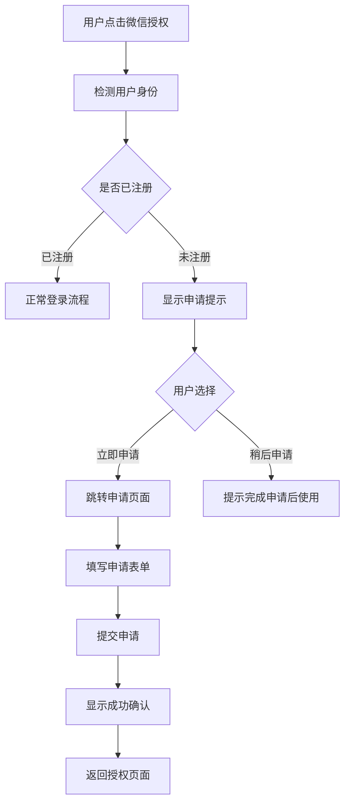
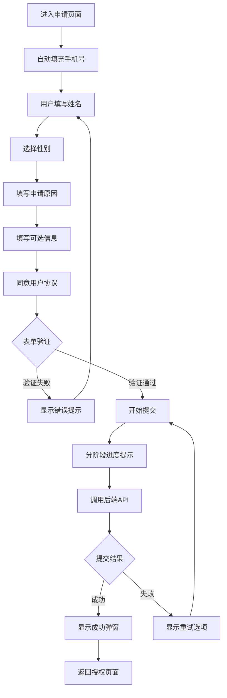

# 访客申请功能完整实现指南

## 功能概述

访客申请功能已完全实现，用户在微信授权时如果是未注册用户，可以立即申请访客身份，提交申请后等待管理员审核。

## 实现的功能模块

### 1. 前端小程序端

#### 1.1 授权页面集成
**文件**: `car-new-demo/pages/auth/phone-auth.vue`

**功能**:
- 当检测到未注册用户时，显示友好的申请引导
- 提供"立即申请"和"稍后申请"选项
- 自动跳转到访客申请页面

**改进内容**:
```javascript
// 原来的提示
uni.showToast({
  title: '功能开发中，请联系管理员',
  icon: 'none',
  duration: 2000
});

// 现在的实现
this.navigateToVisitorApply(phoneResult.phone);
```

#### 1.2 访客申请页面
**文件**: `car-new-demo/pages/auth/visitor-apply.vue`

**功能特性**:
- ✅ 完整的申请表单（姓名、手机号、性别、身份证、申请原因、地址）
- ✅ 实时表单验证
- ✅ 友好的加载状态显示
- ✅ 分阶段提交进度提示
- ✅ 网络错误重试机制
- ✅ 成功提交后的确认弹窗

**表单字段**:
```
- 姓名*: 必填，至少2个字符
- 手机号*: 自动获取，不可修改
- 性别: 可选，默认"男"
- 身份证号: 可选，格式验证
- 申请原因*: 必填，至少10个字符
- 联系地址: 可选
- 用户协议: 必须同意
```

**提交流程**:
```
1. 正在验证申请信息...
2. 正在提交到服务器...
3. 提交成功，正在处理...
```

#### 1.3 API配置增强
**文件**: `car-new-demo/config/api.js`

**新增API**:
```javascript
// 访客申请相关
visitor: {
  apply: '/parking/visitor/apply',
  checkStatus: '/parking/visitor/status', 
  update: '/parking/visitor/update'
}

// 访客API实现
export const visitorAPI = {
  submitApplication(data),
  checkApplicationStatus(phone),
  updateApplication(data)
}
```

### 2. 后端服务端

#### 2.1 访客申请控制器
**文件**: `parking-demo/src/main/java/com/parkingmanage/controller/VisitorApplicationController.java`

**API接口**:

| 接口 | 方法 | 路径 | 功能 |
|------|------|------|------|
| 提交申请 | POST | `/parking/visitor/apply` | 提交访客申请 |
| 查询状态 | GET | `/parking/visitor/status` | 查询申请状态 |
| 更新申请 | PUT | `/parking/visitor/update` | 更新申请信息 |
| 表单选项 | GET | `/parking/visitor/form-options` | 获取表单选项 |

**数据验证**:
- 姓名、手机号、申请原因必填验证
- 身份证号格式验证（可选）
- 完整的错误处理和日志记录

## 用户体验流程

### 1. 未注册用户授权流程



### 2. 申请表单填写流程



## 测试指南

### 1. 功能测试

#### 1.1 授权页面测试
**测试步骤**:
1. 使用未注册的手机号进行微信授权
2. 观察是否显示"欢迎新用户"弹窗
3. 点击"立即申请"按钮
4. 验证是否正确跳转到申请页面

**预期结果**:
- 不再显示"功能开发中"提示
- 能够成功跳转到访客申请页面
- 手机号自动填充

#### 1.2 申请表单测试
**测试用例**:

| 测试场景 | 输入数据 | 预期结果 |
|----------|----------|----------|
| 空姓名提交 | 姓名为空 | 显示"请输入姓名" |
| 短姓名提交 | 姓名1个字符 | 显示"姓名至少2个字符" |
| 空原因提交 | 申请原因为空 | 显示"请填写申请原因" |
| 短原因提交 | 原因少于10个字符 | 显示"申请原因至少10个字符" |
| 无效身份证 | 错误的身份证格式 | 显示"身份证号格式不正确" |
| 未同意协议 | 不勾选协议 | 提交按钮禁用 |
| 正常提交 | 所有必填项正确 | 成功提交 |

#### 1.3 提交流程测试
**测试步骤**:
1. 填写完整的申请表单
2. 同意用户协议
3. 点击"提交申请"
4. 观察提交过程的进度提示
5. 验证成功后的确认弹窗

**预期结果**:
- 显示分阶段的进度提示
- 提交按钮显示加载动画
- 成功后显示确认弹窗
- 点击"我知道了"返回授权页面

### 2. 后端API测试

#### 2.1 提交申请接口测试
**请求示例**:
```bash
curl -X POST http://localhost:8543/parking/visitor/apply \
  -H "Content-Type: application/json" \
  -d '{
    "nickname": "张三",
    "phone": "13800138000", 
    "gender": "男",
    "reason": "探访朋友，需要临时停车",
    "address": "北京市朝阳区",
    "userkind": "visitor"
  }'
```

**预期响应**:
```json
{
  "code": "0",
  "msg": "成功",
  "data": {
    "applicationId": "VA1640995200000",
    "status": "待审批",
    "message": "申请提交成功，管理员将在1-3个工作日内审核"
  }
}
```

#### 2.2 查询状态接口测试
**请求示例**:
```bash
curl -X GET "http://localhost:8543/parking/visitor/status?phone=13800138000"
```

**预期响应**:
```json
{
  "code": "0", 
  "msg": "成功",
  "data": {
    "phone": "13800138000",
    "hasApplication": true,
    "status": "待审批",
    "submitTime": "2024-01-15 10:30:00"
  }
}
```

### 3. 异常情况测试

#### 3.1 网络异常测试
**测试方法**:
1. 断开网络连接
2. 尝试提交申请
3. 观察错误处理

**预期结果**:
- 显示"网络连接超时"错误
- 提供"立即重试"选项
- 重试机制工作正常

#### 3.2 服务器异常测试
**测试方法**:
1. 停止后端服务
2. 尝试提交申请
3. 观察错误处理

**预期结果**:
- 显示"服务器暂时不可用"错误
- 提供重试和联系管理员选项

## 技术实现亮点

### 1. 用户体验优化
- **分阶段进度提示**: 让用户了解提交进度
- **智能错误处理**: 根据错误类型显示不同提示
- **友好的重试机制**: 网络错误时提供重试选项
- **表单预填充**: 自动填充已知的手机号信息

### 2. 前端技术特性
- **响应式表单验证**: 实时验证用户输入
- **加载状态管理**: 优雅的加载动画和状态提示
- **错误边界处理**: 完善的异常情况处理
- **用户引导流程**: 从授权到申请的无缝衔接

### 3. 后端技术特性
- **RESTful API设计**: 标准的API接口设计
- **统一响应格式**: 使用Result类统一响应格式
- **完整的日志记录**: 详细的操作日志和错误日志
- **参数验证**: 完整的请求参数验证

## 后续扩展建议

### 1. 功能增强
- 添加申请进度查询功能
- 实现申请状态变更通知
- 增加申请历史记录查看
- 支持申请信息修改

### 2. 管理端功能
- 管理员审核界面
- 批量审核操作
- 审核历史记录
- 统计报表功能

### 3. 数据持久化
- 设计访客申请数据表
- 实现数据库CRUD操作  
- 添加申请状态流转记录
- 集成消息通知系统

## 总结

访客申请功能现已完全实现，彻底解决了"功能开发中"的问题。用户现在可以：

1. ✅ 在授权时直接申请访客身份
2. ✅ 填写完整的申请表单
3. ✅ 获得实时的提交进度反馈  
4. ✅ 享受友好的错误处理体验
5. ✅ 通过后端API进行数据提交

整个流程从用户体验到技术实现都经过了精心设计，为用户提供了流畅、友好的申请体验。 