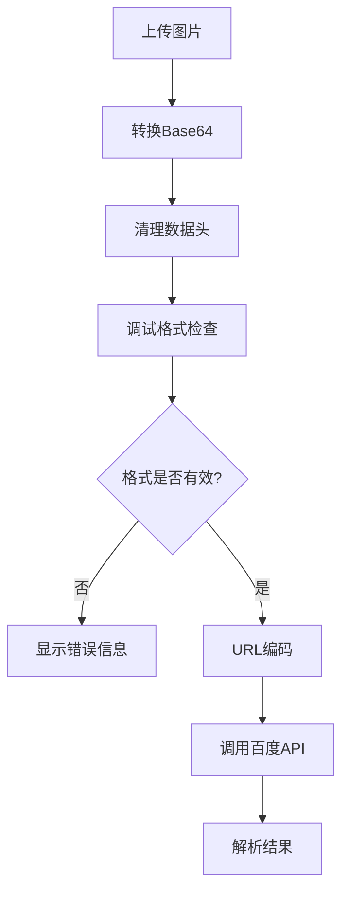

# 车牌识别216201错误最终修复方案

## 错误分析

根据用户提供的百度官方Java示例代码，我们发现了关键问题：

### 问题根源
我们之前错误地认为不需要对base64图片数据进行URL编码，但百度官方示例明确显示需要URL编码：

```java
// 百度官方示例
String imgParam = URLEncoder.encode(imgStr, "UTF-8");
String param = "image=" + imgParam;
```

## 最终修复方案

### 1. 恢复URL编码 ✅

**修改文件**: `PlateRecognitionServiceImpl.java`

```java
// 修正后的代码
String encodedImage = java.net.URLEncoder.encode(base64Image, "UTF-8");
paramBuilder.append("image=").append(encodedImage);
```

### 2. 添加图片格式调试功能 ✅

**新增调试接口**: `/api/plate/debug/image-format`

**功能**:
- 分析base64数据格式
- 检测图片文件头
- 验证图片格式(JPEG/PNG/BMP)
- 返回详细的调试信息

### 3. 前端自动调试 ✅

每次识别前自动调用调试接口，在控制台输出图片分析结果：

```
📊 图片格式调试信息:
格式: JPEG
原始长度: 245032
清理后长度: 245020  
解码大小: 183774字节
文件头: FFD8FFE0
是否有效: ✅
```

## 测试步骤

### 1. 重启后端服务
```bash
cd parking-demo
mvn spring-boot:run
```

### 2. 测试车牌识别
1. 打开微信开发者工具
2. 进入`pages/demo/plate-scanner`页面
3. 选择包含车牌的图片
4. 查看控制台调试信息

### 3. 分析调试结果

**正常情况**:
```
🔍 图片分析结果:
格式: JPEG ✅
原始长度: 245032
清理后长度: 245020
解码大小: 183774字节
文件头: FFD8FFE0
是否有效: ✅
```

**异常情况排查**:
- 格式非JPEG/PNG/BMP → 转换图片格式
- 解码大小过大(>8MB) → 压缩图片
- 是否有效: ❌ → 检查base64数据

## 支持的图片格式

| 格式 | 文件头 | 说明 |
|------|--------|------|
| JPEG | FFD8 | 推荐格式，兼容性最好 |
| PNG | 8950 | 支持透明背景 |
| BMP | 424D | Windows位图格式 |

## 常见错误码解决方案

| 错误码 | 原因 | 解决方案 |
|--------|------|----------|
| 216201 | 图片格式错误 | 使用JPEG/PNG/BMP格式 |
| 216200 | 未检测到车牌 | 确保图片包含清晰车牌 |
| 216103 | 图片过大 | 压缩图片到8MB以下 |
| 110 | 访问令牌无效 | 检查API密钥配置 |

## API调用流程



## 关键代码变更

### 1. URL编码修复

```java
// 修正前 (错误)
paramBuilder.append("image=").append(base64Image);

// 修正后 (正确)
String encodedImage = java.net.URLEncoder.encode(base64Image, "UTF-8");
paramBuilder.append("image=").append(encodedImage);
```

### 2. 调试功能

```java
@ApiOperation("调试图片格式")
@PostMapping("/debug/image-format")
public ResponseEntity<Result<Map<String, Object>>> debugImageFormat(@RequestBody PlateRecognitionRequest request) {
    // 分析图片格式、大小、有效性
    // 返回详细调试信息
}
```

## 预期效果

修复后应该不再出现216201错误，并且：

1. ✅ 图片格式自动检测
2. ✅ 详细的调试信息
3. ✅ 正确的URL编码
4. ✅ 符合百度官方规范

## 如果仍有问题

请提供以下信息：
1. 控制台调试输出
2. 后端服务日志
3. 测试图片的格式和大小
4. 具体错误信息

---

**更新时间**: 2025-06-28  
**状态**: �� 最终修复方案，应解决216201错误 