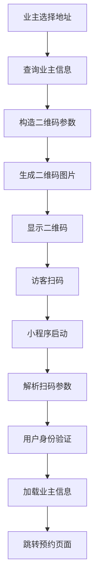

# 访客二维码生成与扫码跳转实现文档

## 概述

本文档详细介绍了微信小程序中访客二维码的生成机制和扫码跳转的实现方式。该功能主要用于停车场管理系统中，业主为访客生成邀请二维码，访客通过扫码可以快速完成预约流程。

## 技术架构

### 核心文件结构
```
mini/pages/invite/               # 二维码生成页面
├── invite.js                   # 核心逻辑
├── invite.wxml                 # 界面模板
└── invite.wxss                 # 样式文件

mini/utils/
└── weapp-qrcode.js            # 微信小程序二维码生成库

mini/pages/appointment/         # 预约相关页面
└── appointmentInvite/         # 邀请预约页面
```

## 二维码生成实现

### 1. 核心依赖
```javascript
const QR = require('../../utils/weapp-qrcode.js'); 
const EncryptUtils = require('../../utils/encrypt/encryptUtils')
```

### 2. 二维码生成流程

#### 2.1 参数构造
在确认地址选择后，系统会构造二维码参数：

```javascript
// 生成时间戳
let date = new Date();
let time = date.getTime(); 
let timeunix = parseInt(time / 1000); 

// 构造二维码URL参数
params: 'https://www.xuerparking.cn:8543/verify/share/' + 
        '&applyKind=2&inviteId=' + res.data.data[0].id + 
        '&time=' + timeunix
```

**参数说明：**
- `applyKind=2`: 申请类型，2表示访客邀请
- `inviteId`: 业主信息ID，用于关联具体的房屋信息
- `time`: 时间戳，用于二维码有效期验证

#### 2.2 二维码绘制
```javascript
drawImg: function (){
    let that = this,
        params = that.data.params;  // 二维码参数  
    console.log(params); 
    var imgData = QR.drawImg(params, {
        typeNumber: 4,          // 密度等级
        errorCorrectLevel: 'L', // 纠错等级 (L/M/Q/H)
        size: 800,              // 图片尺寸
    });
    // 设置二维码图片数据
    this.setData({
        qrcodeURL: imgData
    })
}
```

### 3. 界面展示
```xml
<!-- WXML模板 -->
<view style="text-align:center;">
    <image style="width:300rpx;height:300rpx;" src="{{ qrcodeURL }}"></image>
</view>    

<view class="buttondisplay">  
    <button class="save" bindtap="doShare">分享</button>
    <button class="save" bindtap="doSave">保存</button>
</view>
```

### 4. 二维码操作功能

#### 4.1 分享功能
```javascript
doShare: function(){
    var that = this;
    if(that.data.address == ""){
        wx.showToast({
            title: '请选择地址！',
            duration: 1000,
            mask: true,
        });
        return;
    }        
    var imgSrc = this.data.qrcodeURL; // base64编码
    imgSrc = imgSrc.replace(/^data:image\/\w+;base64,/, '');
    var save = wx.getFileSystemManager();
    var number = Math.random();
    
    save.writeFile({
        filePath: wx.env.USER_DATA_PATH + '/pic' + number + '.gif',
        data: imgSrc,
        encoding: 'base64',
        success: res => {
            wx.showShareImageMenu({
                path: wx.env.USER_DATA_PATH + '/pic' + number + '.gif',
                success: (res1) => {
                    console.log("分享成功：", res1);
                },
                fail: (err) => {
                    console.log("分享取消：", err);
                }
            })
        }
    })
}
```

#### 4.2 保存功能
```javascript
doSave: function(){
    var that = this;
    // 地址验证
    if(that.data.address == ""){
        wx.showToast({
            title: '请选择地址！',
            duration: 1000,
            mask: true,
        });
        return;
    }      
    
    var imgSrc = this.data.qrcodeURL; // base64编码
    imgSrc = imgSrc.replace(/^data:image\/\w+;base64,/, '');
    var save = wx.getFileSystemManager();
    var number = Math.random();

    save.writeFile({
        filePath: wx.env.USER_DATA_PATH + '/pic' + number + '.gif',
        data: imgSrc,
        encoding: 'base64',
        success: res => {
            wx.saveImageToPhotosAlbum({
                filePath: wx.env.USER_DATA_PATH + '/pic' + number + '.gif',
                success: function (res) {
                    wx.showToast({
                        title: '保存成功',
                        duration: 2000,
                        mask: true,
                        success: function(){
                            wx.navigateBack({
                                delta: 1,
                            })
                        },              
                    });
                },
                fail: function (err) {
                    console.log(err)
                }
            })
        }
    })
}
```

## 扫码跳转实现

### 1. 小程序启动处理
在 `app.js` 中处理小程序启动时的用户身份识别：

```javascript
onLaunch() {
    var that = this; 
    that.initApp();
},

initApp() {
    var that = this;
    // 微信登录获取code
    wx.login({
        success: res => {
            codedata = {
                "code": res.code        
            };  
            // 通过code获取openid
            wx.request({
                url: api.Get_Openid,
                data: (codedata),
                method: 'GET',
                success: function (res) {
                    that.globalData.openid = res.data.data.data.data.openid; 
                    // 根据openid查询用户信息
                    that.checkUserIdentity();
                }
            });         
        }
    })
}
```

### 2. 用户身份验证流程
```javascript
// 用户身份验证的层级结构：
// 1. 访客用户 (Member_FindByOpenid)
// 2. 管家用户 (Butler_FindByOpenid)  
// 3. 巡逻员 (Patrol_FindByOpenid)
// 4. 新用户注册

checkUserIdentity: function() {
    wx.request({
        url: api.Member_FindByOpenid + '/' + that.globalData.openid,
        success: function (res1) {       
            if(res1.data.data.data.data.count == 0) {
                // 检查是否为管家
                that.checkButler();
            } else {
                // 访客用户
                that.globalData.userkind = '访客'; 
                that.globalData.userphone = res1.data.data.data.data.userphone;
                that.globalData.checkLogin = true;             
            }
        }
    });
}
```

### 3. 扫码参数解析
当用户通过扫码进入小程序时，系统会解析二维码中的参数：

```javascript
// 二维码URL格式：
// https://www.xuerparking.cn:8543/verify/share/&applyKind=2&inviteId=123&time=1640000000

// 参数解析处理：
onLoad: function(options) {
    var that = this;
    // 获取扫码参数
    if(options.scene) {
        // 解码scene参数
        var scene = decodeURIComponent(options.scene);
        that.parseQRParams(scene);
    }
    
    // 其他页面参数处理
    if(options.inviteId) {
        that.setData({
            inviteId: options.inviteId,
            visitorPhone: options.visitorPhone,
        });
        that.loadOwnerInfo();
    }
}
```

### 4. 业主信息加载
根据邀请ID加载对应的业主和房屋信息：

```javascript
loadOwnerInfo: function() {
    var that = this;
    wx.request({
        url: api.Get_OwnerById,
        method: "GET",
        data: {    
            id: that.data.inviteId,               
        },
        success: function(res) { 
            if(200 == res.statusCode){  
                let ownerinfo = res.data.data;
                that.setData({
                    ownerinfo: ownerinfo,
                    address: ownerinfo.community + ownerinfo.building + "栋" +
                            ownerinfo.units + "单元" + ownerinfo.floor + "层" + 
                            ownerinfo.roomnumber + "门",
                    community: ownerinfo.community,
                    building: ownerinfo.building,
                    units: ownerinfo.units,
                    floor: ownerinfo.floor,
                    room: ownerinfo.roomnumber,  
                    province: ownerinfo.province,
                    city: ownerinfo.city,
                    district: ownerinfo.district,   
                    ownername: ownerinfo.ownername,
                    ownerphone: ownerinfo.ownerphone,                                          
                }); 
            }
        }
    });  
}
```

## 数据流转图



## 关键API接口

### 1. 获取OpenID
```
GET /api/Get_Openid?code={wechat_code}
```

### 2. 根据ID获取业主信息
```
GET /api/Get_OwnerById?id={owner_id}
```

### 3. 查询用户身份
```
GET /api/Member_FindByOpenid/{openid}
GET /api/Butler_FindByOpenid/{openid}  
GET /api/Patrol_FindByOpenid/{openid}
```

### 4. 访问原因查询
```
GET /api/Get_Query_VisitReason
```

## 安全考虑

### 1. 时间戳验证
- 二维码包含生成时间戳，可用于验证二维码的有效期
- 建议在服务端验证时间戳，超过有效期的二维码应拒绝处理

### 2. 参数加密
- 敏感参数可以考虑加密传输
- 当前使用的EncryptUtils工具支持MD5和Base64编码

### 3. 用户权限验证
- 通过层级身份验证确保只有合法用户才能访问相应功能
- 不同身份用户拥有不同的操作权限

## 使用示例

### 1. 业主生成访客二维码
```javascript
// 1. 选择地址
// 2. 系统查询该地址的业主信息
// 3. 生成包含inviteId的二维码
// 4. 业主可以分享或保存二维码
```

### 2. 访客扫码预约
```javascript
// 1. 访客扫描二维码进入小程序
// 2. 系统解析二维码参数获取inviteId
// 3. 根据inviteId加载业主和房屋信息
// 4. 访客填写预约信息完成预约
```

## 注意事项

1. **地址选择必填**：生成二维码前必须选择完整的地址信息
2. **权限验证**：需要验证业主是否开启了访客自助预约功能
3. **VIP车辆处理**：系统会检查车辆是否为VIP，VIP车辆无需预约
4. **错误处理**：需要妥善处理网络异常、参数错误等各种异常情况
5. **用户体验**：提供清晰的操作提示和状态反馈

## 扩展建议

1. **二维码有效期**：可以增加二维码有效期设置功能
2. **批量邀请**：支持一次生成多个访客的邀请二维码
3. **访问统计**：记录二维码的生成和使用情况
4. **推送通知**：访客预约成功后推送通知给业主 